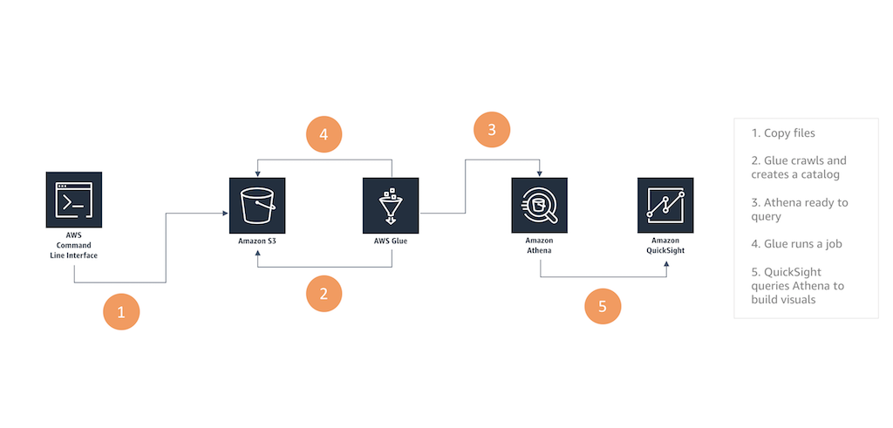

# Overview
Come and learn how to leverage Amazon S3, Amazon Glue, Amazon Athena and Amazon QuickSight to upload a dataset to your central data lake, automate the creation of a data catalog, transform data to a compressed columnar format that allows to speed up and reduce the cost of your processes, query the data using standard SQL and create and share rich web-based visualizations. Do this all without having to manage clusters or having to spin up a single instance.

https://reinvent.awsevents.com/learn/builders-sessions/

Builders Sessions are 60-minute small groups sessions with up to five customers and one AWS expert, who is there to help, answer questions, and provide guidance. It’s just you, your laptop, and the AWS expert.

Each builders session begins with a short explanation or demonstration of what you are going to build. There will not be any formal presentation. Once the demonstration is complete, you will use your laptop to experiment and build with the AWS expert.

# Architecture

# Walkthrough
## [Step 1: Upload a dataset to Amazon S3](step-one.md)
## [Step 2: Automate the creation of a Data Catalog](step-two.md)
## [Step 3: Transform data into a compressed columnar format](step-three.md)
## [Step 4: Query the data using standard SQL](step-four.md)
## [Step 5: Create and Share rich web-based visualizations](step-five.md)

# Appendix:
Installing the AWS CLI
https://docs.aws.amazon.com/cli/latest/userguide/installing.html

I prefer to use Homebrew for a Mac
https://github.com/aws/aws-cli/issues/727

Configuring the AWS CLI
https://docs.aws.amazon.com/cli/latest/userguide/cli-chap-getting-started.html

Copy objects between S3 buckets
https://aws.amazon.com/premiumsupport/knowledge-center/move-objects-s3-bucket/

AWS Glue Built-in classifiers
https://docs.aws.amazon.com/glue/latest/dg/add-classifier.html#classifier-built-in

Parquet data format
https://parquet.apache.org/documentation/latest/

Setting up QuickSight
https://docs.aws.amazon.com/quicksight/latest/user/signing-in.html
