# Step 5: Create and Share rich web-based visualizations
In this step, we'll start by setting up a new QuickSight account with a standard subscription using https://quicksight.aws.amazon.com/ (see [appendix](README.md#appendix) for more details).

## 5.1 Configure QuickSight Athena and S3 access
Go to QuickSight Account Settings b clicking on your username on the top right corner. Then click on "Account Settings" and then on "Manage QuickSight Permissions"
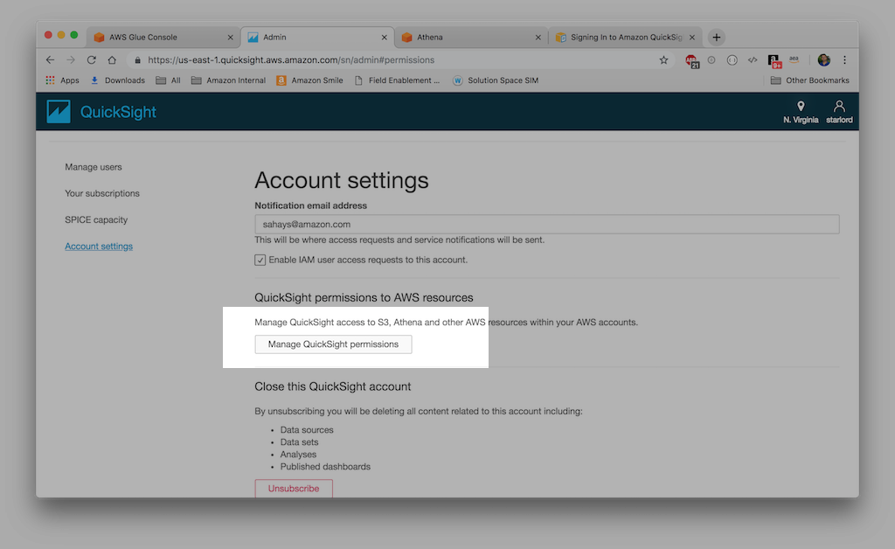

Ensure "Amazon Athena" is checked. Then click on "Choose S3 buckets" to pick the target S3 bucket.
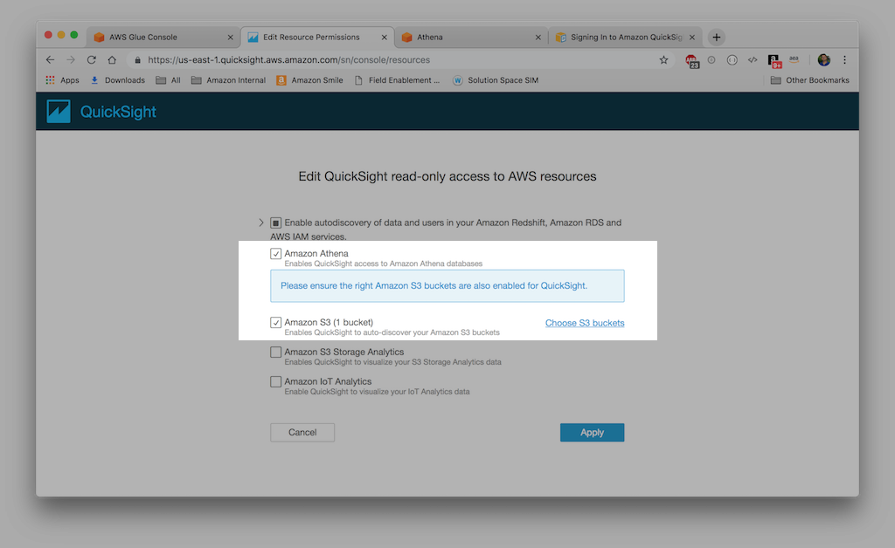

## 5.2 Create a new Analysis
You use an analysis to create and interact with visuals. You can think of an analysis as a container for a set of related visuals, for example ones that are all applicable to a given business goal or key performance indicator. A visual is a graphical representation of your data. You can create a wide variety of visuals in an analysis, using different data sets and visual types. 

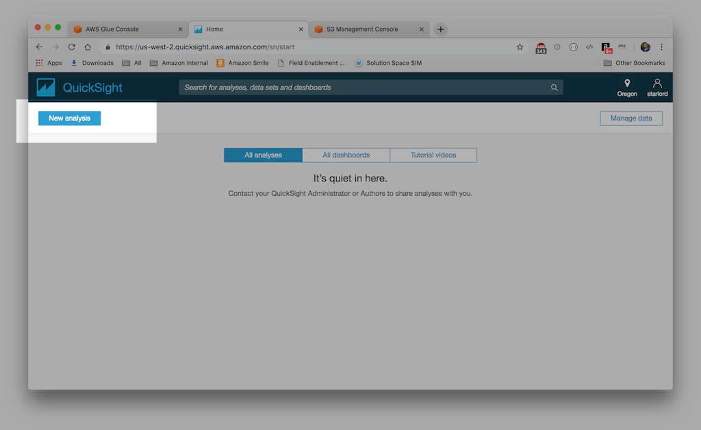

## 5.3 Create a new Data set
A data set identifies the specific data in a data source that you want to use. For example, the data source might be a table if you are connecting to a database data source, or a file if you are connecting to an Amazon S3 data source. A data set also stores any data preparation you have performed on that data, such as renaming a field or changing its data type.

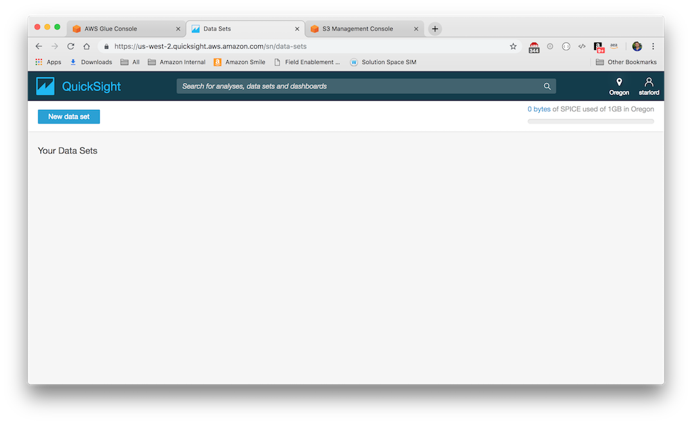

Choose Athena to create a new data set
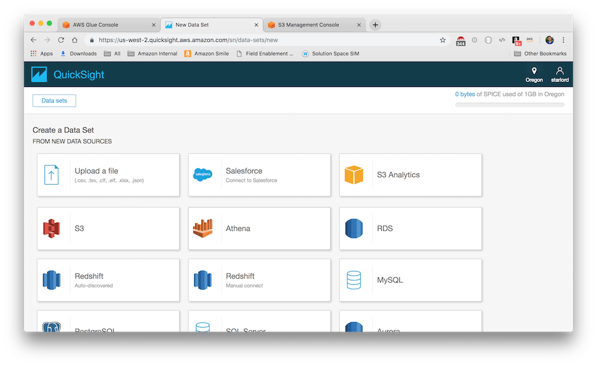

Provide a name for the new Athena data source. Use "Top 10K"
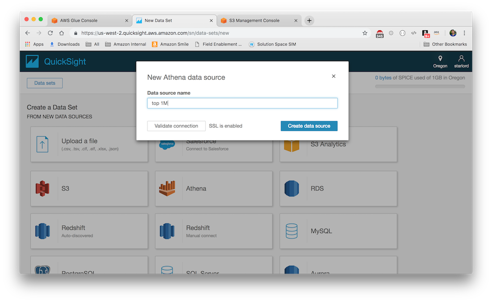

Click on "Use custom SQL" when asked to choose your table
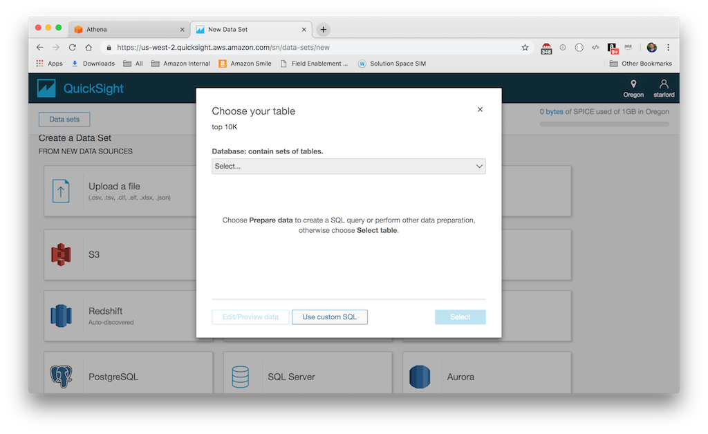

Input the following custom SQL, and name it "Top 10K"
```SQL
SELECT * FROM "s6r8n6"."pq_nyc_tlc" limit 10000;
```
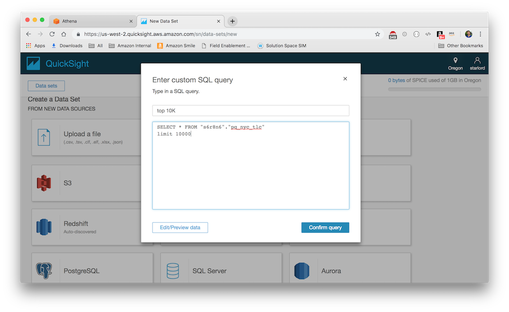

SPICE is Amazon QuickSight's Super-fast, Parallel, In-memory Calculation Engine. SPICE is engineered to rapidly perform advanced calculations and serve data. The storage and processing capacity available in SPICE speeds up the analytical queries that you run against your imported data. By using SPICE, you save time because you don't need to retrieve the data every time you change an analysis or update a visual.

Finish data set creation by importing the data to SPICE. 
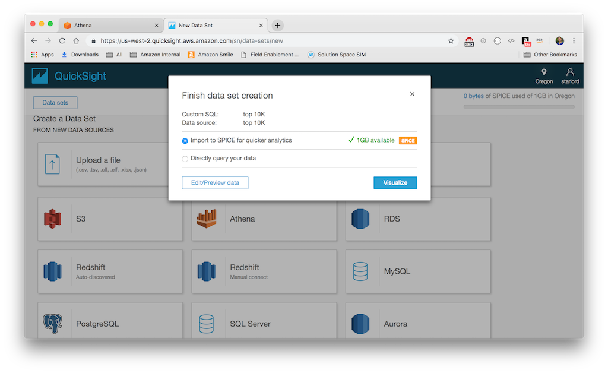

Now, wait for the import into SPICE to complete
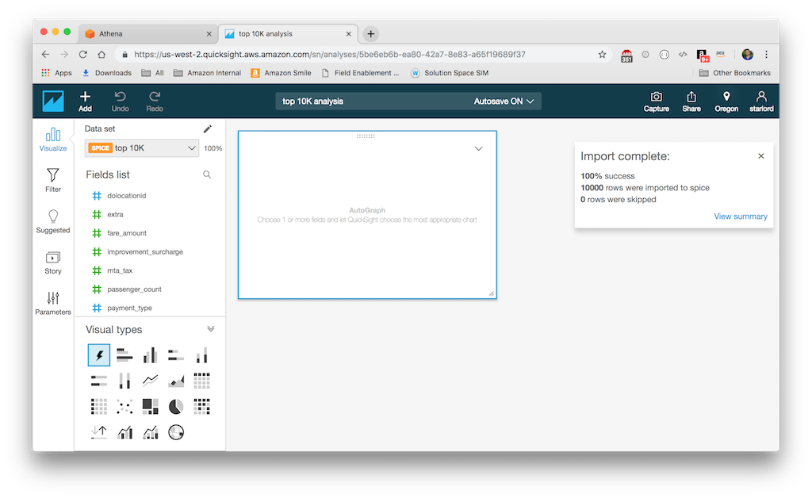

## 5.4 Create a new Visual
Watch the following videos that I have prepared for this session to learn about how to create a visual with filters and aggregation

[Amazon QuickSight Tutorial: Create Visual with Autograph](https://youtu.be/toKeIayOp2g)

[Amazon QuickSight Tutorial: Create Visuals and apply Filter](https://youtu.be/Wh8BAn228SE)

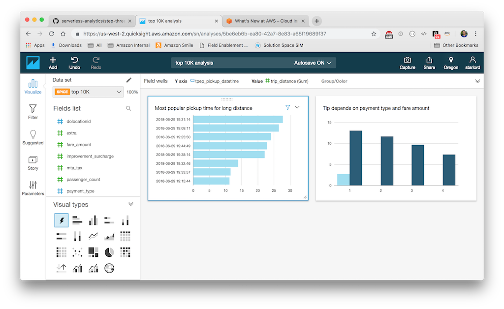

# Congratulations! 
You are at the end of this session. Kudos to you and pat yourself on the back you have completed this session. Don't forget to leave your comment and rate this session.


[<< Home](README.md)