# Step 3: Transform data into a compressed columnar format
We'll use AWS Glue Jobs to perform this step. A job is your business logic required to perform extract, transform and load (ETL) work. Job runs are initiated by triggers which can be scheduled or driven by events. The data store in your S3 bucket contains data in csv format. In this step, we'll use AWS Glue Jobs to transform the csv data into Parquet which is columnar and compressed data format. Columnar data results in a faster query performance and compression helps Athena to scan a smaller amount of data in S3 to output the same result.

## 3.1: Modify IAM policy
Before you run the job, it's important to understand the S3 bucket and folder structure so that proper IAM policies can be applied to S3 bucket
```
<your-S3-bucket>
|- ds-csv (folder for all csv data sets)
|-- nyc-tlc (source CSV)
|- ds-pq (target parquet files that the job will emit as output of this job)
|- jobs (folder for keeping all the job related data e.g. scripts and temporary files)
|-- scripts
|-- temp
```
When we created the crawler in Step 2, we allowed it to create a role (AWSGlueServiceRole-xxx) that was assumed by Glue to access S3 bucket. By default, it used the "ds-csv/nyc-tlc" folder inside the bucket to assign s3:GetObject and s3:PutObject permissions. In this job, we are going to use 2 folders "ds-pq" and "jobs" at the same level as "ds-csv". The folder "ds-pq" will store the parquet files that the job will emit as output of this job. The folder "jobs" will contain "scripts" and "temp" as specified in the step 3.2.1. This job will use the same role and it's important to modify the role **otherwise the job will fail**

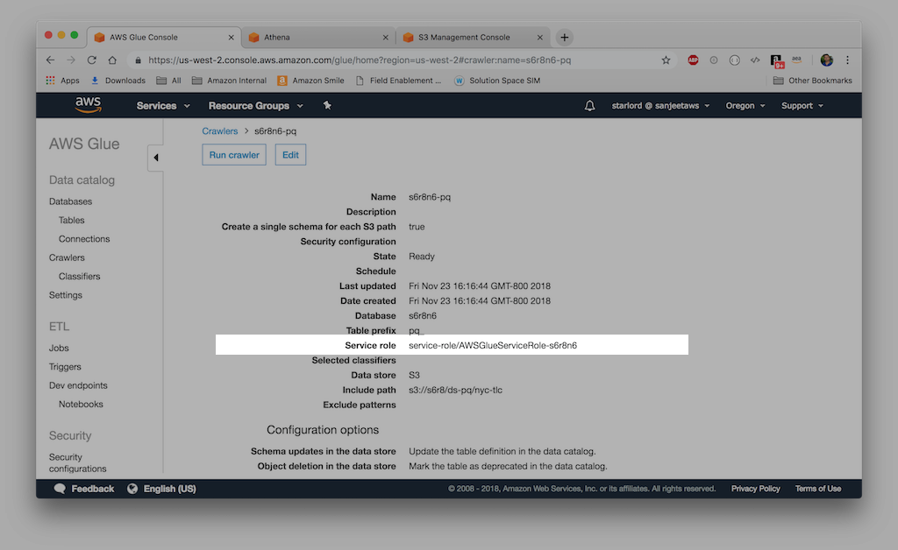

We are going to modify the IAM policy attached to the following role:
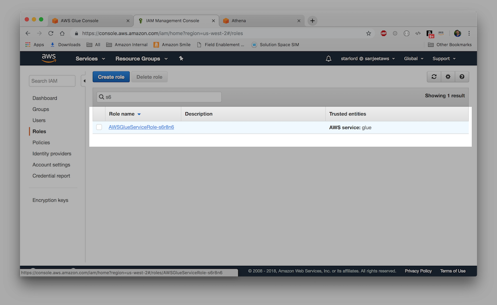

We'll change the policy to allow read/write access to all folders inside the S3 bucket. To make that change, change the managed policy in the role to:
```JSON
{
    "Version": "2012-10-17",
    "Statement": [
        {
            "Effect": "Allow",
            "Action": [
                "s3:GetObject",
                "s3:PutObject",
                "s3:DeleteObject"
            ],
            "Resource": [
                "arn:aws:s3:::<your-s3-bucket>/*"
            ]
        }
    ]
}
```
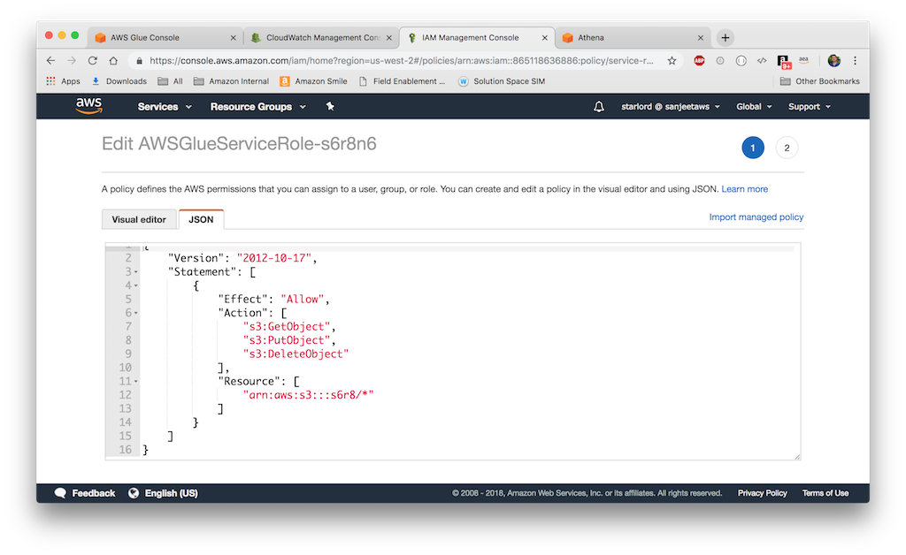


## 3.2: Add a job
Click on the "Jobs" menu in the left side panel. Click on "Add job" button to start adding a new job using a wizard.

## 3.2.1: Configure the job properties
Specify a name for the job. Choose the same IAM role that you used to create the crawler in Step 2. Accept the default values for "This job runs", and "ETL Language". We'll allow this Job wizard to create a python script for us that will transform CSV into Parquet. 
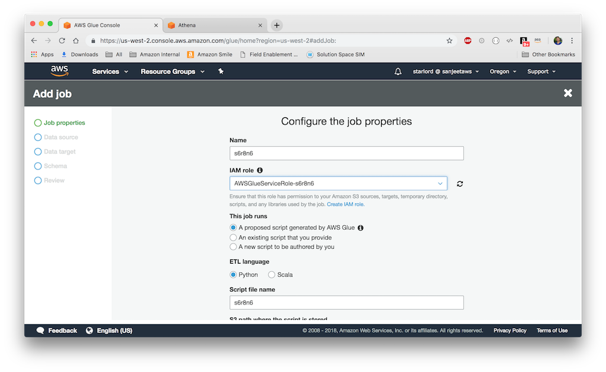

Script name is auto populated with the name of the Job. Specify "S3 path where the script is stored" as a folder inside the S3 bucket that you created in Step 1. I have used "jobs/scripts" folder to store the scripts generated by this job, and "jobs/temp" for storing any temporary files that the job needs to create.
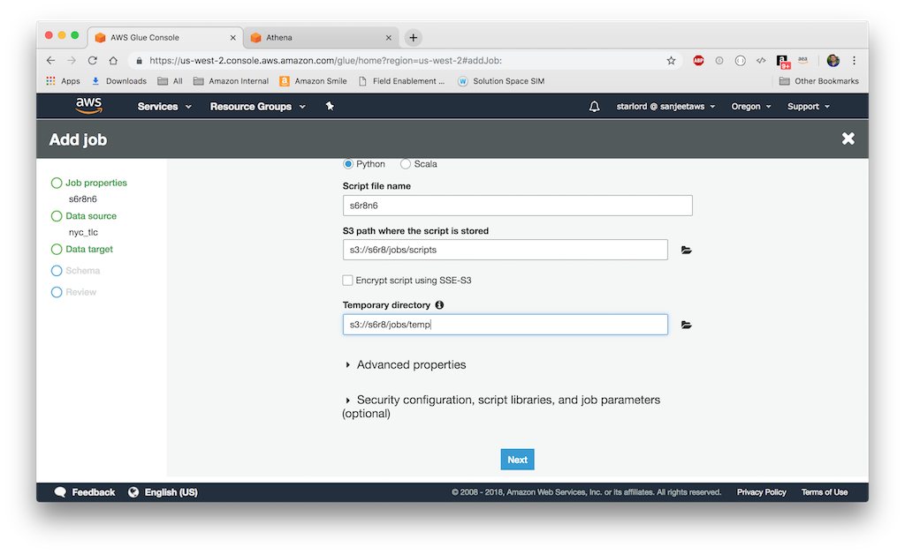

## 3.2.2: Choose a data source
This step in the wizard allows you to pick a Glue metadata table that acts as the source of data that the job will use to transform to a target data format. I have picked the only table that the crawler created in Step 2.
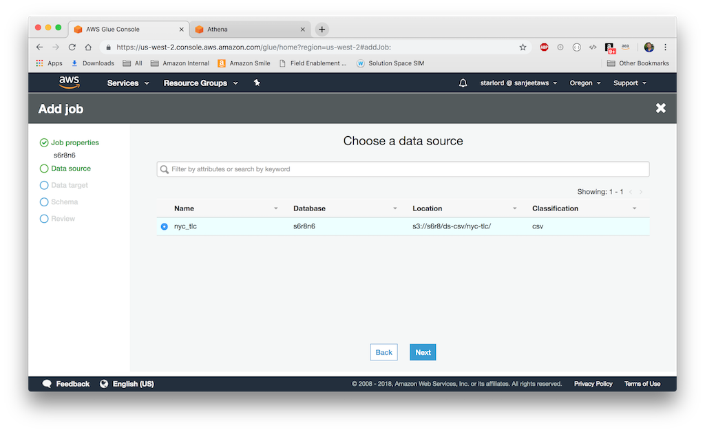

## 3.2.3: Choose a data target
In this step, I have used the following values
```
Data Store: Amazon S3
Format: Parquet (this is the target format we are trying to transform the CSV into as a result of this job run)
Target path: <your-s3-bucket>/ds-pq/nyc-tlc
```
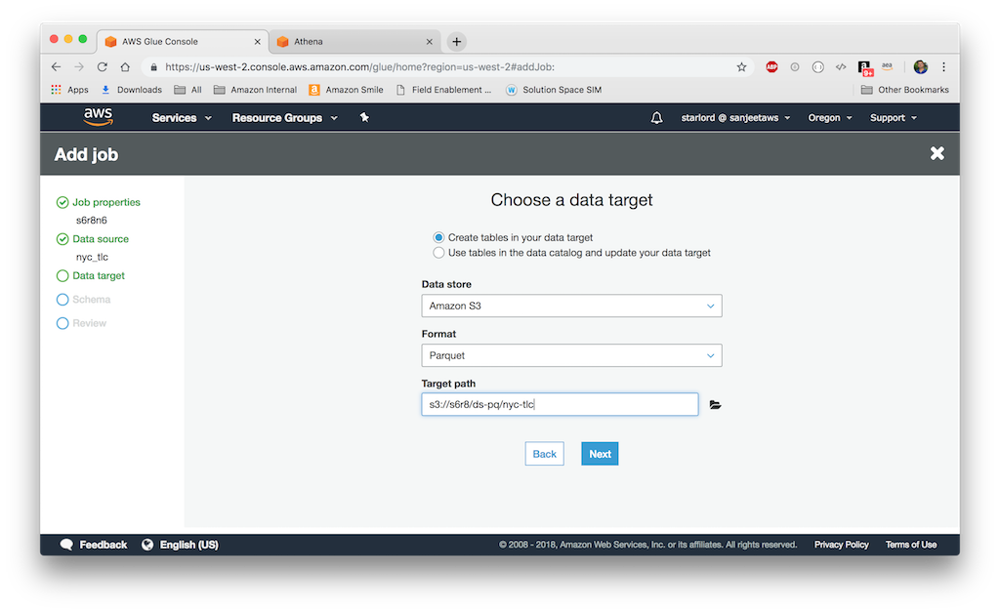

## 3.2.3: Review or modify the source/target column mapping
This step allows you to modify or review the source and the target columns mapping. 
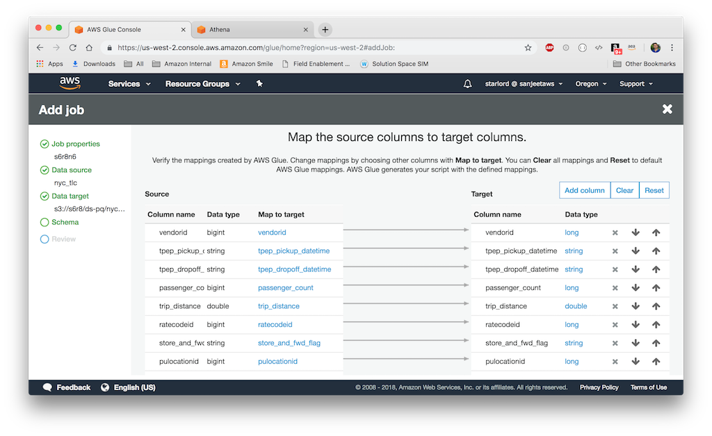

## 3.2.4: Review the job summary
Finally, review the job summary and if everything looks ok click on "Save job and edit script"
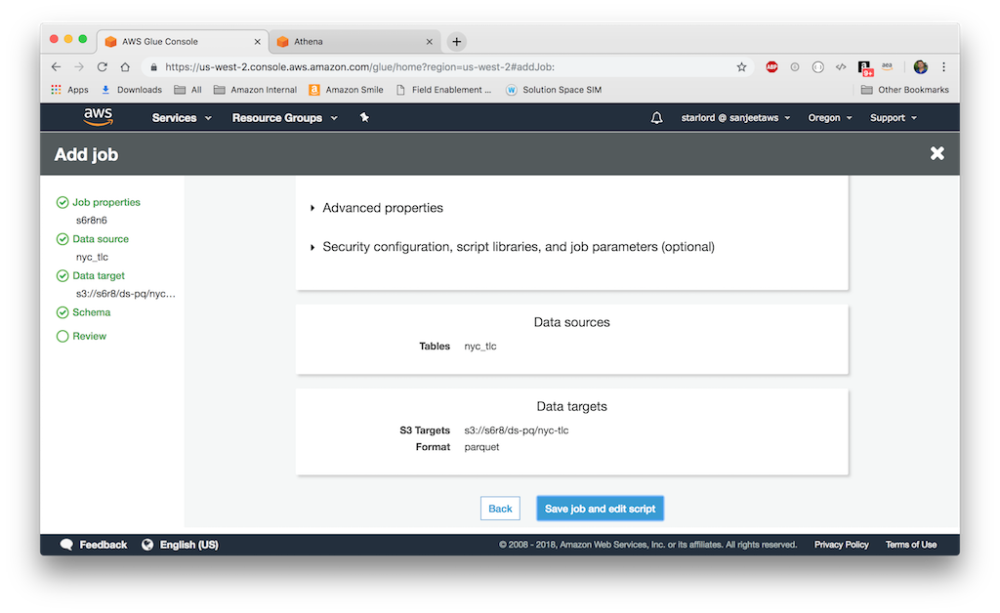

## 3.2.5: Edit script (optional, no action required)
In this step, you'll see a diagram on the left that describes what transformations the script is going to apply to source to produce an output that will be saved to the target. Source and target both in this case are Amazon S3. The transformations are:
```
Apply mapping: source to target column mappings
```
```
Resolve choice: make_struct (Resolves a potential ambiguity by using a struct to represent the data. For example, if data in a column could be an int or a string, using the make_struct action produces a column of structures in the resulting DynamicFrame with each containing both an int and a string.)
```
```
Drop null fields: Drops all null fields in a DynamicFrame whose type is NullType. These are fields with missing or null values in every record in the DynamicFrame data set.
```
**Let's talk about DynamicFrame** It's an improvement over Spark DataFrame construct which is similar to a table and supports functional-style (map/reduce/filter/etc.) operations and SQL operations (select, project, aggregate). DataFrame require a schema to be specified before any data is loaded. SparkSQL DataFrame addresses this by making two passes over the data—the first to infer the schema, and the second to load the data. However, it doesn't provide finer control over how schema dependencies are resolved in real world data that may have different representations of the same data e.g. string or int value for currency. To address these limitations, AWS Glue introduces the DynamicFrame which doesn't require a schema initially. Instead, AWS Glue computes a schema on-the-fly when required, and explicitly encodes schema inconsistencies using a choice (or union) type. The following creates a DataFrame from a Glue catalog:

```
datasource0 = glueContext.create_dynamic_frame.from_catalog(
    database = "<database>", 
    table_name = "<table>", 
    transformation_ctx = "datasource0")
```
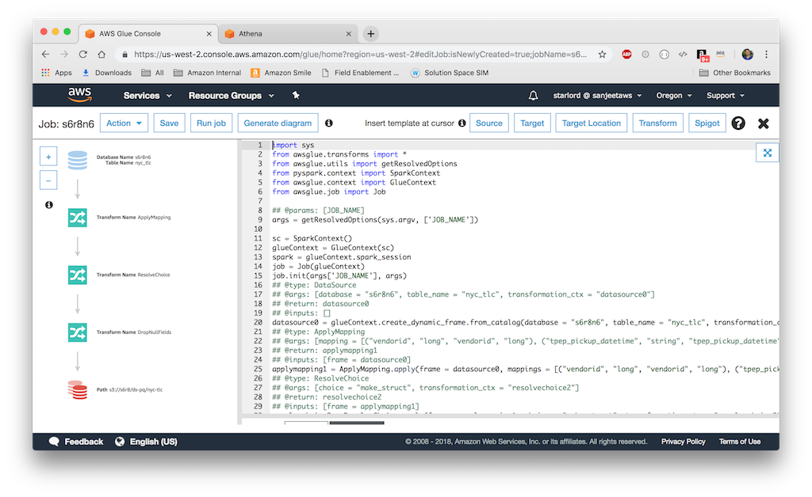

The following lines of code incrementally picks from the "dropnullfields3" frame and then writes to the DynamicFrame using Parquet format:
```
datasink4 = glueContext.write_dynamic_frame.from_options(
    frame = dropnullfields3, 
    connection_type = "s3", 
    connection_options = {"path": "<s3-source-path>"}, 
    format = "parquet", 
    transformation_ctx = "datasink4")
```
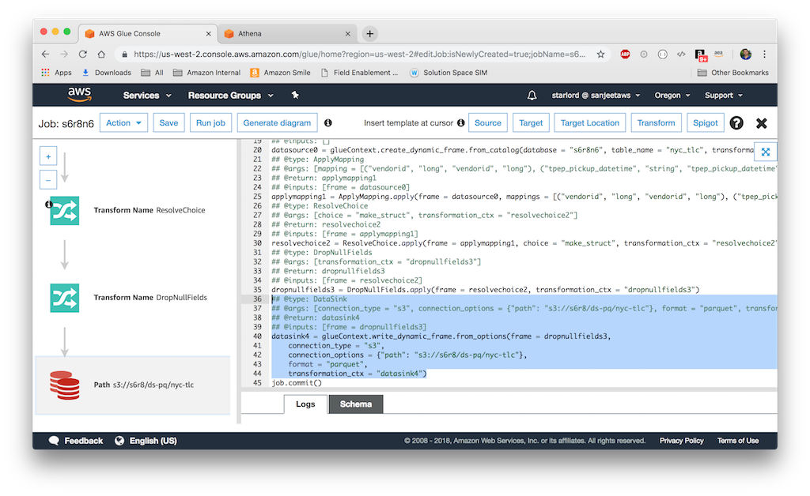

## 3.2.6: Save and run the job
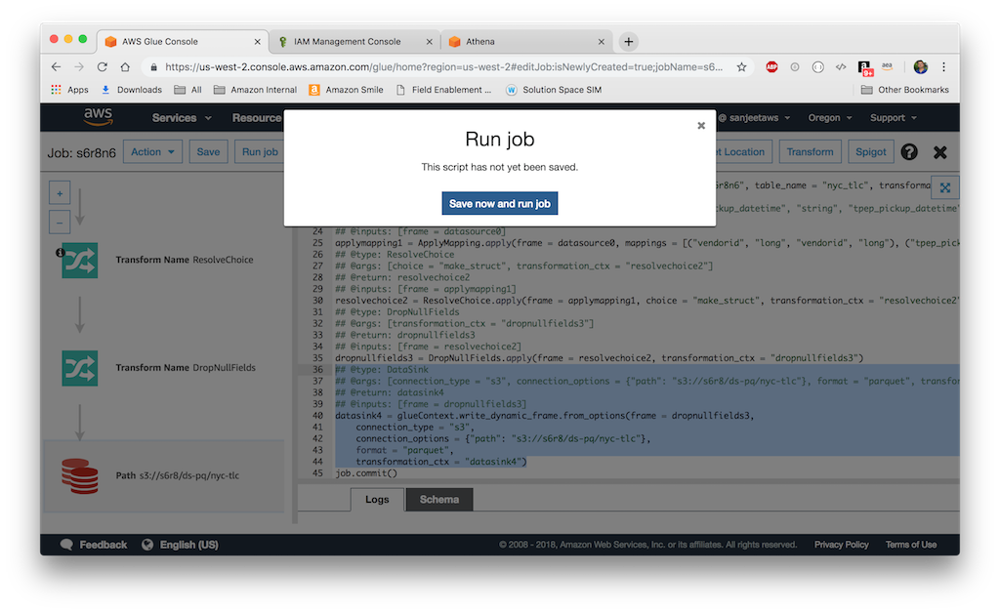

Click on the "Jobs" menu in the left side panel, then select the job to view its history. Wait for the running job to complete with a run status of "Succeeded". In my case, the job run took about 3-5 minutes.
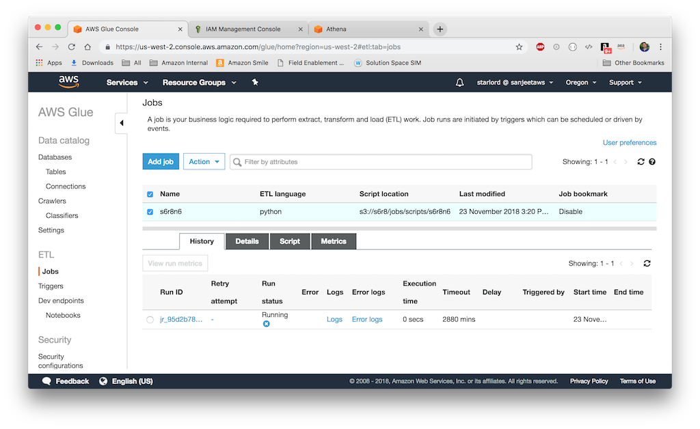

## 3.3: Review the output of the job in S3
Let's take a look at the source CSV folder: [your-s3-bucket]/ds-dsv
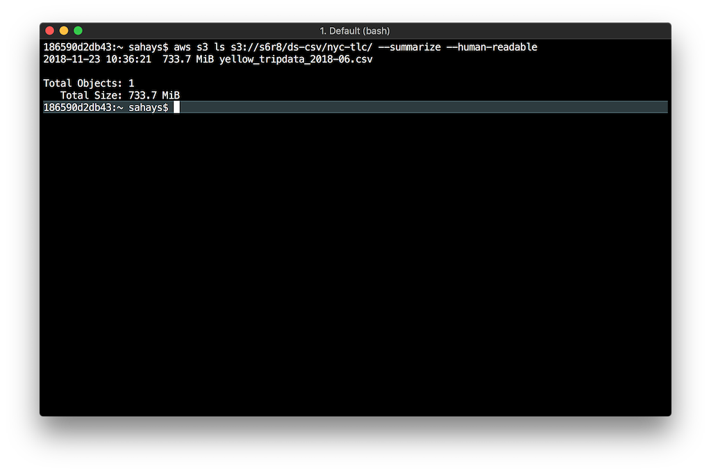

Now, compare that with the output Parquet folder: [your-s3-bucket]/ds-pq
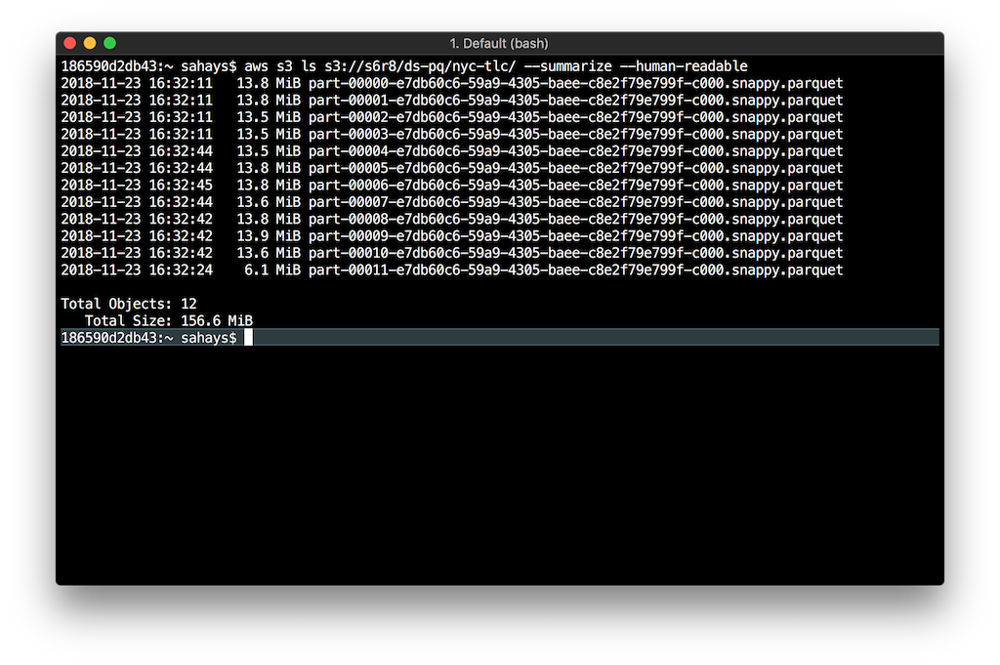

It's impressive to see how Parquet files reduced the size of the source data file by ~80% 

## 3.4: Create a New Glue Crawler for the Parquet data store
Following the steps described in Step 2, create a new crawler to create a new Glue metadata table using the following properties. Creating a new crawler instead of modifying the existing one makes it easier for us to configure them independently. With an existing crawler, you have the option to edit it and add another data store to it.
```
Name: s6r8n6-pq (feel free to choose your name)
IAM Role: AWSGlueServiceRole-s6r8n6 (the same IAM role that you used to create the first Crawler and the job)
Include path: s3://<your-s3-bucket>/ds-pq/nyc-tlc
Data Store: S3
Table prefix: pq_
Create a single schema for each S3 path: true
```
After creating the crawler, run it, and then compare the resulting metadata table with the previous one.

### 3.5: Use Athena to query the data store
Select your table from the list of tables and then click on "View Data". This launches Amazon Athena where we can perform queries directly to the S3 data store using the schema generated by the crawler. Execute the following SQL and then note the improvements in execution time and data scanned over the last execution in Step 2.3
```SQL
SELECT count(vendorid) AS vendors, vendorid
FROM "s6r8n6"."pq_nyc_tlc"
group by vendorid
order by vendors desc;
```
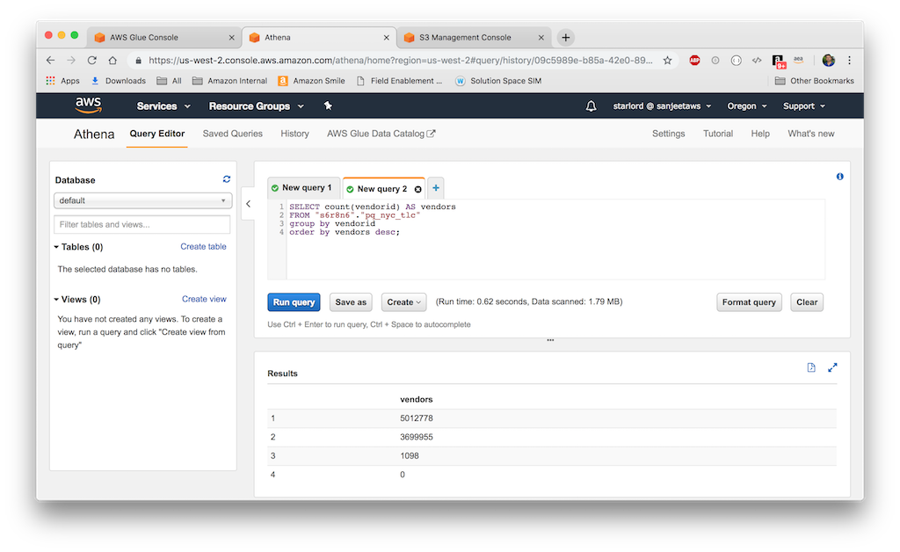


[<< Home](README.md) [Next >>](step-four.md)